# flw (fast light widgets)

flw is an collection of widgets for the [FLTK](http://www.fltk.org) gui library.
They work on most platforms that FLTK 1.4 are supported.
This library has been tested on Windows 10 + msys2, Xubuntu 23.10 & 22.04 (intel).
Earlier versions have been compiled successfully on a Raspberry Pi 4.
It might work on macOS with some tweaks.
They are compiled with C++17 flag and all widgets are in the namespace flw.
The source will NOT compile with Microsoft Visual Studio.

Use then amalgamated version of all source files in the root directory of flw (flw.h, flw.cpp). 
The source files in the src/ directory are intended for development of flw.

Most widgets are released under the [GNU General Public License v3.0](LICENSE).

Widgets:
* Chart - Chart widget with dates as x data.
* DateChooser - Show month date view.
* Grid - Edit data in TableEditor with built in storage.
* GridGroup - A layout widget using a grid.
* InputMenu - Similar to Fl_Input_Choice, but can keep track of an history list and use arrow keys in the input widget to switch between strings.
* LcdNumber - Number widget in lcd style.
* Plot - Numerical chart.
* ScrollBrowser - Scroll faster and let user copy a line to clipboard.
* SplitGroup - A layout widget for two widgets that can be resized with mouse.
* TableDisplay - Show data in a grid.
* TableEditor - Edit data in a grid.
* ToolGroup - A layout widget for a horizontal or vertical group of widgets.
* TabsGroup - A tabbed layout widget that can have tabs at every direction. Tabs can be moved or selected with keyboard shortcuts.

Dialogs:
* AbortDialog - Show a message dialog and let user abort current work.
* FontDialog - Select a font.
* dlg::date - Show a date selection dialog.
* dlg::html - Show text in a html view.
* dlg::list* - Show a list of strings.
* dlg::password* - Ask user for password and optional password confirmation.
* dlg::select* - Let user select a string from a list and also to filter shown strings.
* dlg::text - Show text in an editor widget.
* dlg::theme - Let user select a theme.

## Screenshots of some of the widgets

Chart widget (flw::Chart) 
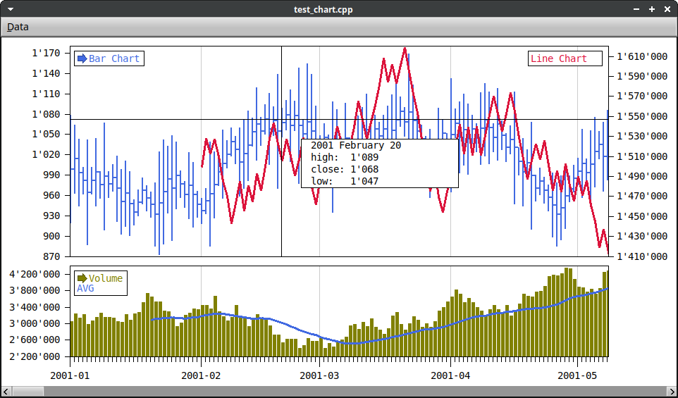

Date chooser widget (flw::DateChooser) 
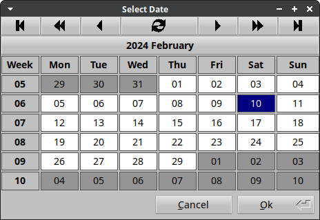

Font dialog (flw::dlg::FontDialog) 
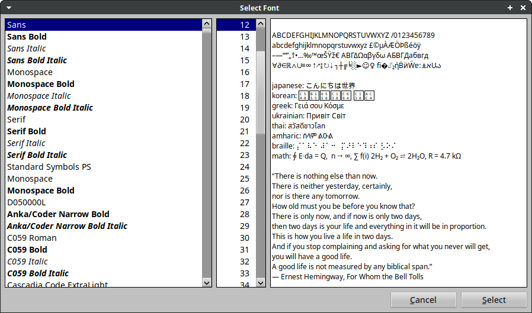

Input menu (flw::InputMenu) 
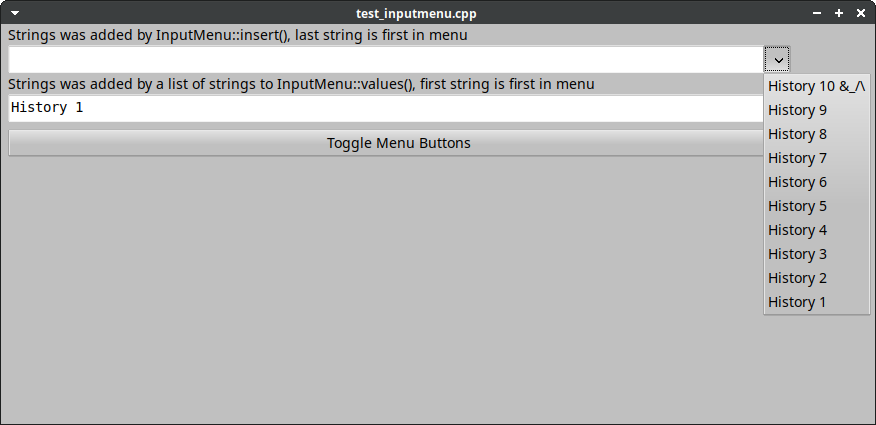

List selection dialog (flw::dlg::select()) 
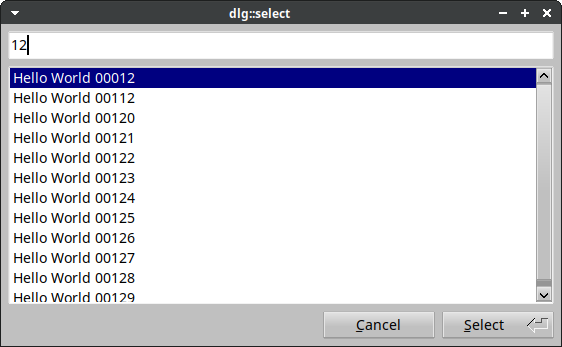

Password dialog (flw::dlg::password4()) 
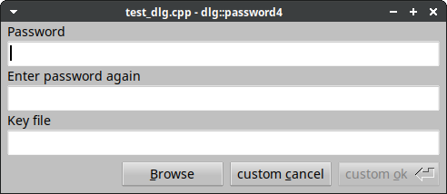

Plot widget (flw::Plot) 
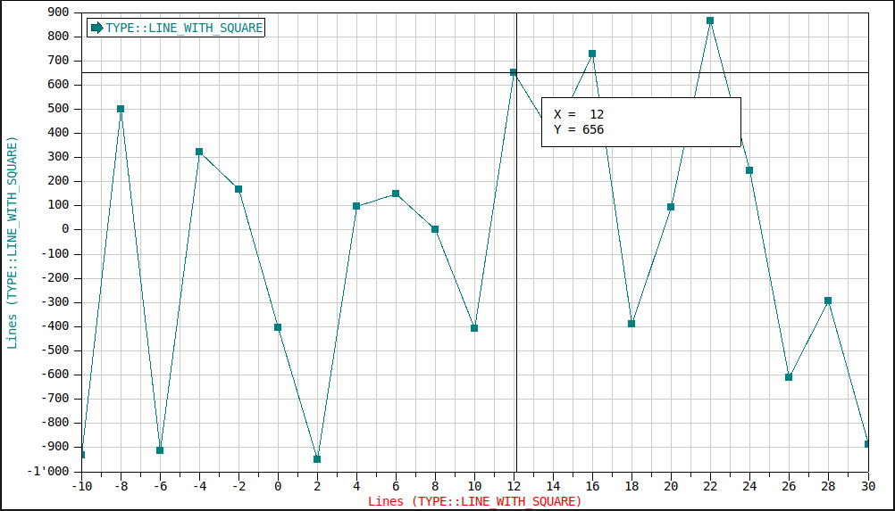

Table editor widget (flw::TableDisplay and flw::TableEditor) 
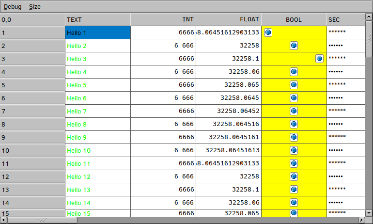

Grid layout widget (flw::GridGroup) 
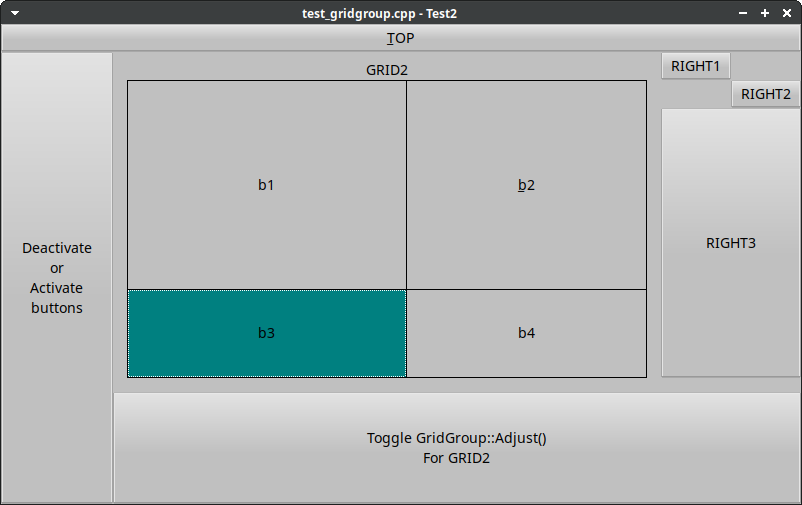

Tab layout widget (flw::TabsGroup) 
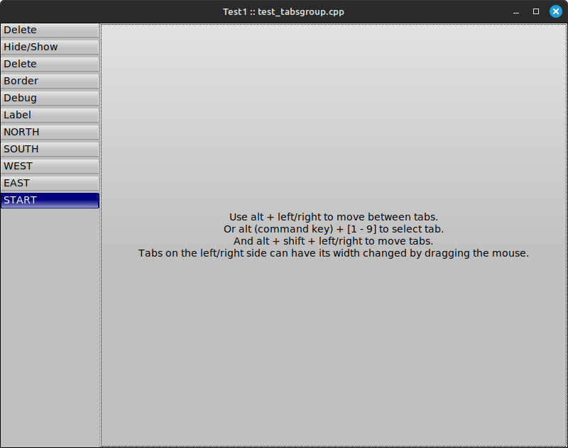

Toolbar layout widget (flw::ToolGroup) 
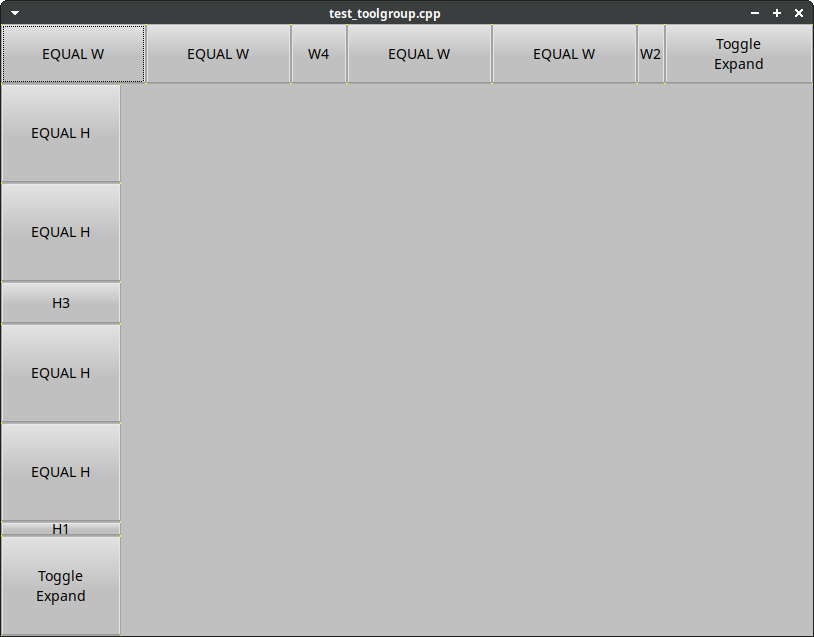

Theme dialog (flw::dlg::theme()) 
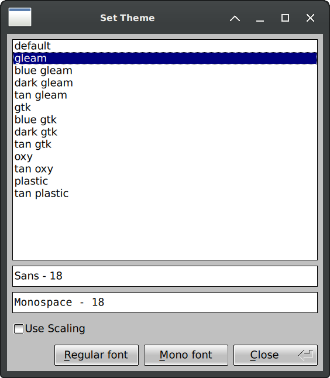

## Theme examples

Tan gleam theme 
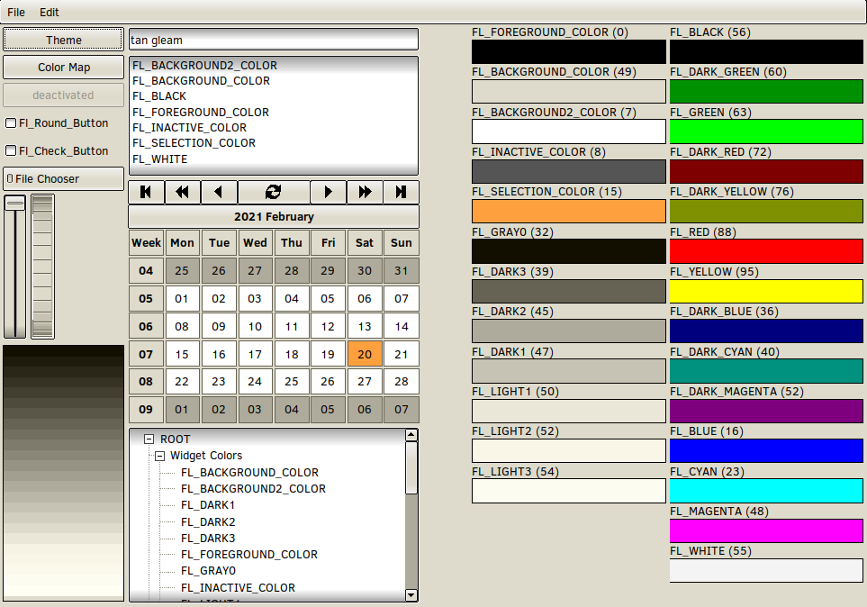

Blue gtk theme 
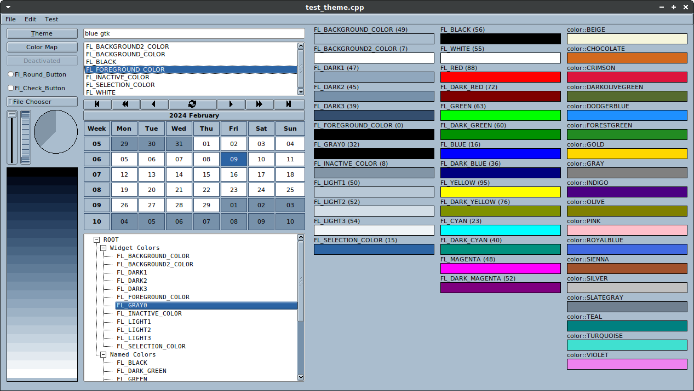

Dark blue gleam theme 
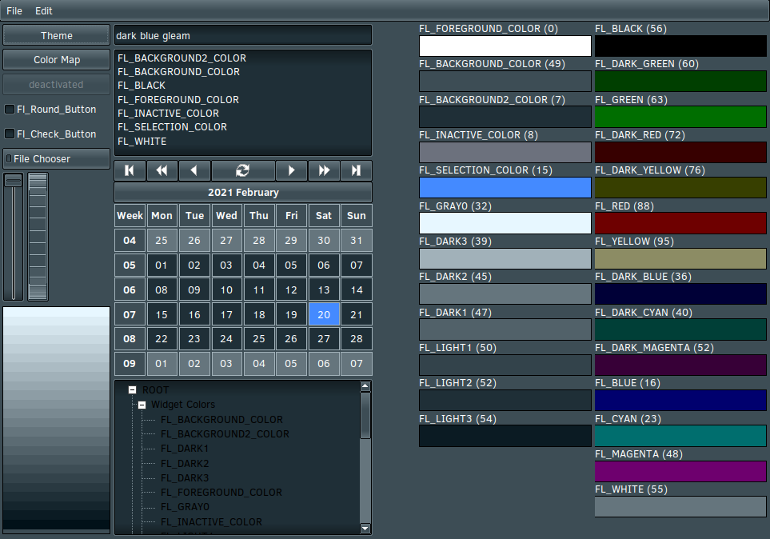

Dark gtk theme 
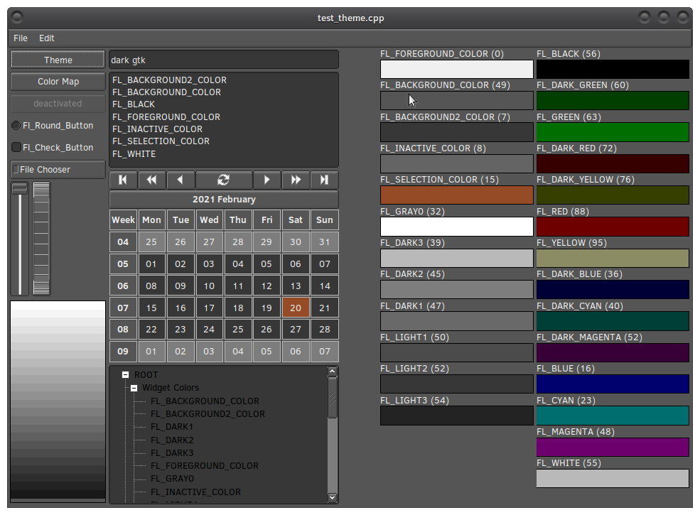
