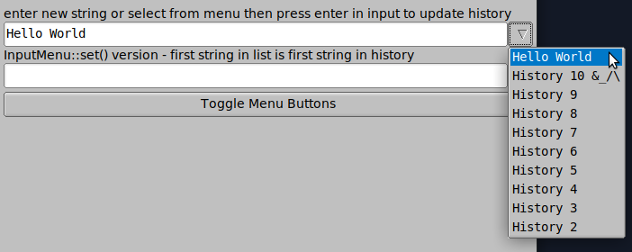

# flw (fast light widgets)

flw is an collection of widgets for the [FLTK](http://www.fltk.org) gui library.
They work on all platforms that FLTK are supported.
This library has been tested on Windows 10 + msys2, Ubuntu 21.04 (intel), Ubuntu mate (arm64 and with FLTK version 1.4.
They are compiled with c++17 flag and all are in the namespace flw. The source will not compile with Microsoft Visual Studio as it is.

There is an amalgamated version of all source files in the top directory.

Most widgets are released under the [GNU General Public License v3.0](LICENSE).

Widgets:
* Chart - Chart widget with dates as x data.
* DateChooser - Show month date view.
* TableDisplay - Show data in a grid.
* TableEditor - Edit data in a grid.
* Grid - Edit data in TableEditor with build in storage.
* LcdNumber - Number widget in lcd style.
* GridGroup - An layout widget using a grid.
* SplitGroup - An layout widget for two widgets that can be resized with mouse.
* TabsGroup - An tabbed layout widget that can have tabs at every direction. Tabs can be moved or selected with keyboard shortcuts.
* InputMenu - Similar to Fl_Input_Choice, but can keep track of an history list and use arrow keys in the input widget to switch between strings.
* ScrollBrowser - Scroll faster and let user copy a line to clipboard.

Dialogs:
* FontDialog - Select a font.
* AbortDialog - Show an message dialog and let user abort current work.
* dlg::html - Show text in a html view.
* dlg::list* - Show an list of strings.
* dlg::password* - Ask user for password and optional password confirmation.
* dlg::select* - Let user select a string from an list and also to filter shown strings.
* dlg::text - Show text in an editor widget.
* dlg::text_edit - Edit text dialog.
* dlg::date - Show an date selection dialog.
* dlg::theme - Let user select a theme.

## Screenshots of some of the widgets

Chart widget (flw::Chart) 

Date chooser widget (flw::DateChooser) 

Table editor widget (flw::TableDisplay and flw::TableEditor) 

Grid layout widget (flw::GridGroup) 

Tab layout widget (flw::TabsGroup) 

Input menu (flw::InputMenu) 

Font dialog (flw::dlg::FontDialog) 

Password dialog (flw::dlg::password4()) 

List selection dialog (flw::dlg::select()) 

Theme dialog (flw::dlg::theme()) 

## Theme examples

Dark blue gleam theme 

Dark gtk theme 

Tan gleam theme 

Blue gtk theme 

