# flw (fast light widgets)

flw is an collection of widgets for the [FLTK](http://www.fltk.org) gui library.
They work on all platforms that FLTK are supported.
This library has been tested on Windows 10 + msys2, solus + gcc and macOS 10.13 + clang and with FLTK version 1.4.
They are compiled with c++17 flag and all are in the namespace flw. The source will not compile with Microsoft Visual Studio as it is.

There is an amalgamated version of all source files in the top directory.

Most widgets are released under the [GNU General Public License v3.0](LICENSE).

Chart widget 
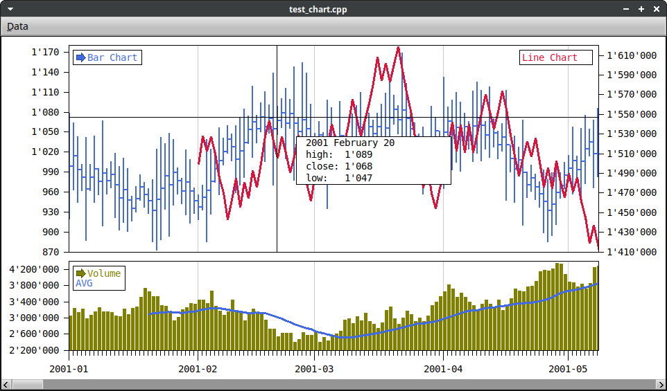

Date chooser widget 
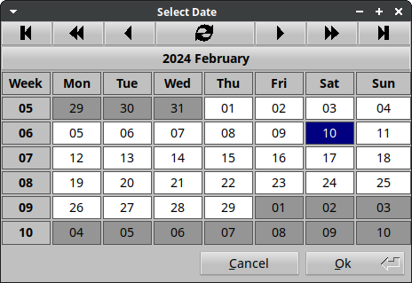

Table editor widget 
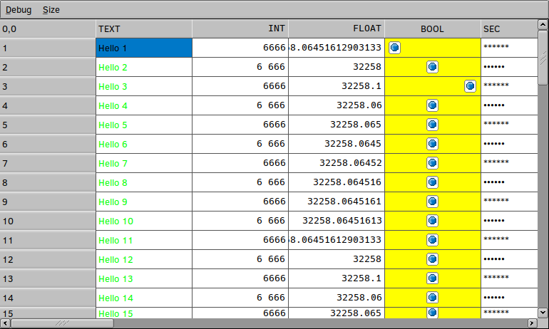

Grid layout widget 
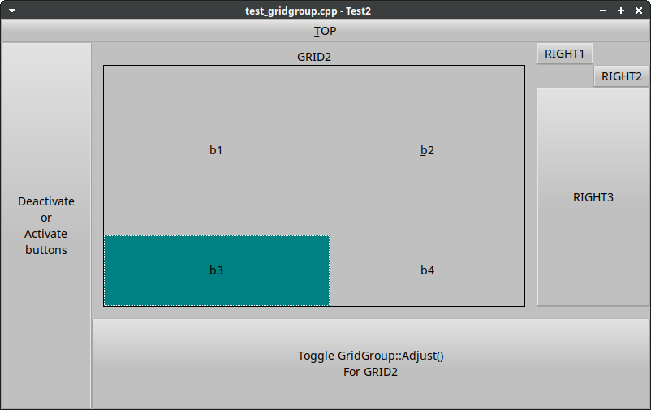

Tab layout widget 
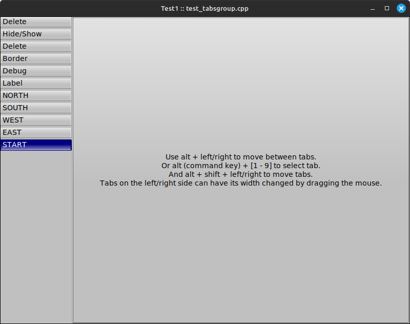

Font dialog 
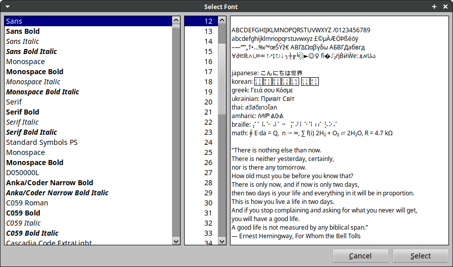

Password dialog 
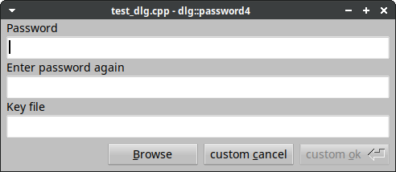

List dialog 
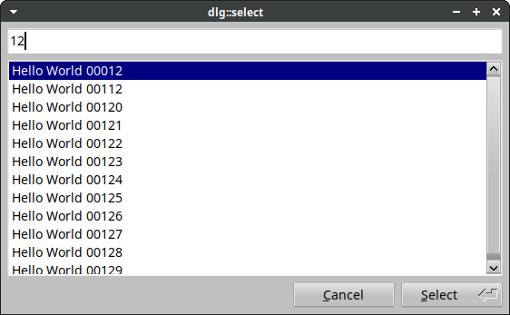

Theme dialog 
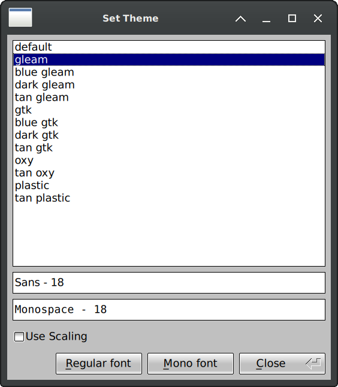

Dark blue gleam theme 
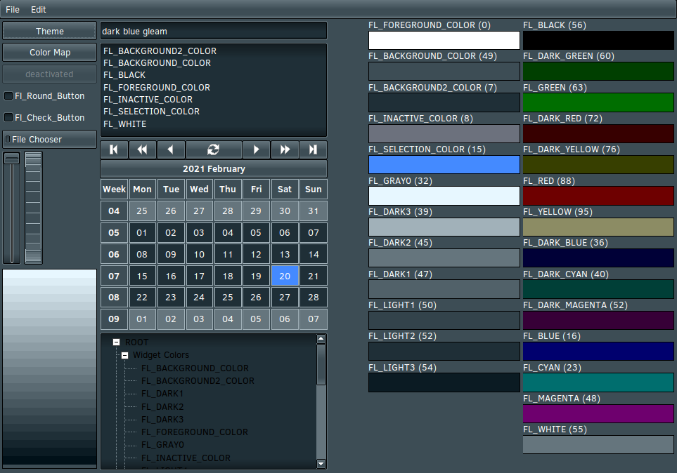

Dark gtk theme 
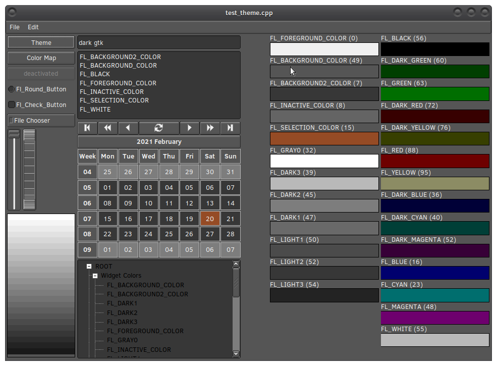

Tan gleam theme 
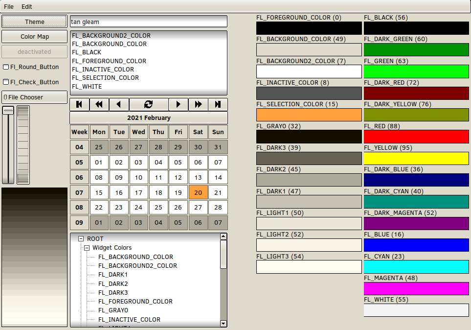

Blue gtk theme 
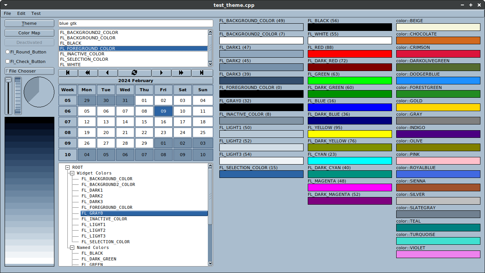
