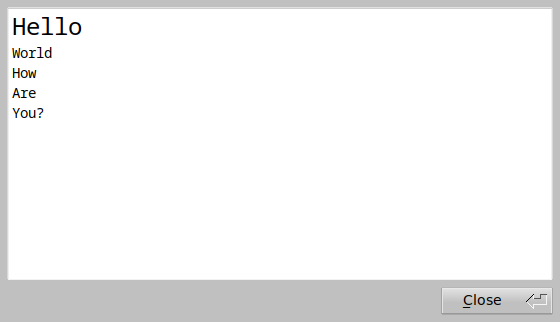
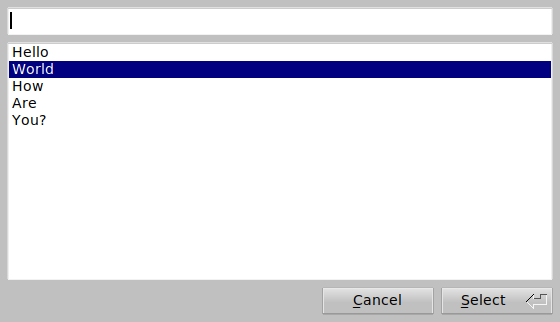
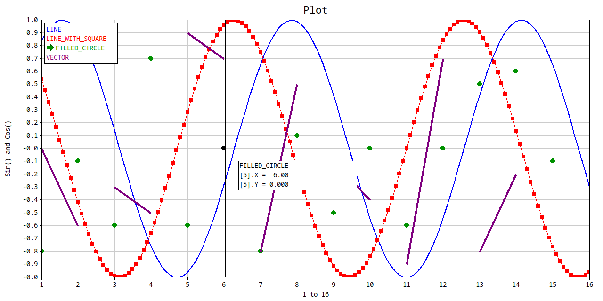

# flw (fast light widgets)

flw is an collection of widgets for the [FLTK](http://www.fltk.org) version 1.4 GUI library.
The flw library has been tested on Windows 10 using msys2 compiler tools and Kubuntu 25.10.
It might work on macOS with some tweaks.

FLTK must be compiled with --enable-use_std flag.
The source will NOT compile with Microsoft Visual Studio.
The API is not stable and may change from time to time.

The source are using C++17 features. 
All FLTK related classes and functions are in namespace flw. 
None gui classes are in namespace gnu (Date, File, JS). 

Use the amalgamated version of all source files in the root directory of flw (flw.h, flw.cpp). 
The source files in the src/ directory are intended for development of flw. 
Although date.h, date.cpp, file.h, file.cpp json.h, json.cpp are completely 
independent of flw and FLTK and can be used stand-alone.

All files (except lcddisplay.h, lcddisplay.cpp) are released under the [GNU General Public License v3.0](LICENSE).

Widget classes:
* flw::chart::Chart - Chart widget with dates/numbers.
* flw::DateChooser - Show month date view.
* flw::FontDialog - A dialog for selecting font and font size.
* flw::GridGroup - A layout widget using a grid.
* flw::InputMenu - Similar to Fl_Input_Choice, but can keep track of an history list.
* flw::LCDDisplay - 7 segment display.
* flw::plot::Plot - A simple numerical chart widget.
* flw::ProgressDialog - A dialog with a message list and a progress bar for time consuming work.
* flw::ScrollBrowser - Scroll faster and let user copy a line to clipboard.
* flw::SplitGroup - A layout widget for two widgets that can be resized with mouse.
* flw::table::Table - A table editor with built in storage.
* flw::table::TableDisplay - Show data in a grid.
* flw::table::TableEditor - Edit data in a grid.
* flw::ToolGroup - A layout widget for a horizontal or vertical group of widgets.
* flw::TabsGroup - A tabbed layout widget that can have tabs at every direction. Tabs can be moved or selected with keyboard shortcuts.
* flw::SVGButton - A button that can load icons from an svg image.

Dialog functions:
* flw::dlg::font() - A dialog for selecting font and font size.
* flw::dlg::date() - Show a date selection dialog.
* flw::dlg::html() - Show text in a html view.
* flw::dlg::input*() - Some input dialogs.
* flw::dlg::list*() - Show a list of strings.
* flw::dlg::msg*() - Some message dialogs.
* flw::dlg::password*() - Ask user for password and optional password confirmation.
* flw::dlg::print() - Print widget to postscript.
* flw::dlg::print_text*() - Print plain text to postscript.
* flw::dlg::select_checkboxes() - Show a dialog with a list of checkboxes.
* flw::dlg::select_choice() - Show a string selection dialog with Fl_Choice.
* flw::dlg::select_string*() - Let user select a string from a list and also to filter shown strings.
* flw::dlg::slider() - Show a number input dialog that uses a Fl_Hor_Value_Slider widget.
* flw::dlg::text() - Show text in an editor widget.
* flw::dlg::text_edit() - Show and edit a text in an editor widget.
* flw::dlg::theme() - Let user select a theme.

## Screenshots of some of the widgets

Date dialog 

Font dialog 

Password dialog 

List dialog 

Select string dialog 

Checkbox dialog 

Message dialog 

Text input dialog 

Theme dialog 

Grid layout widget 

Tab layout widget 

Table widget 

Chart widget 

Plot widget 

